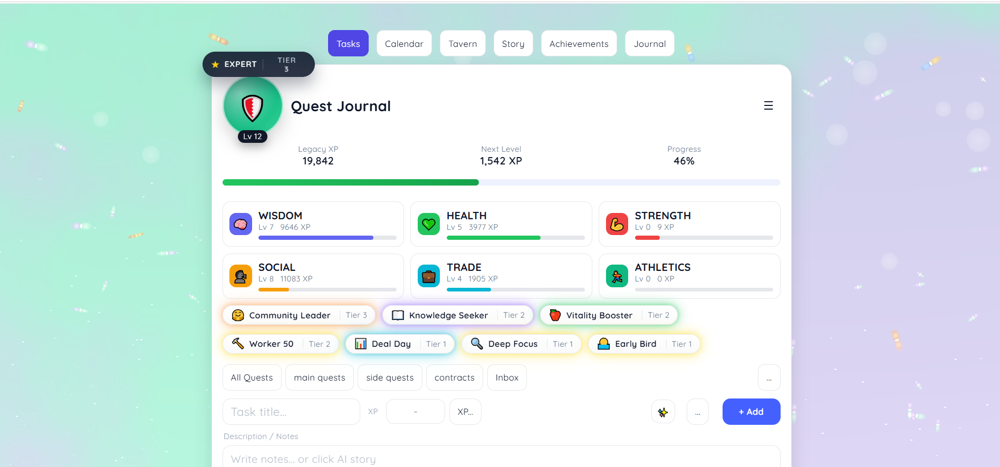
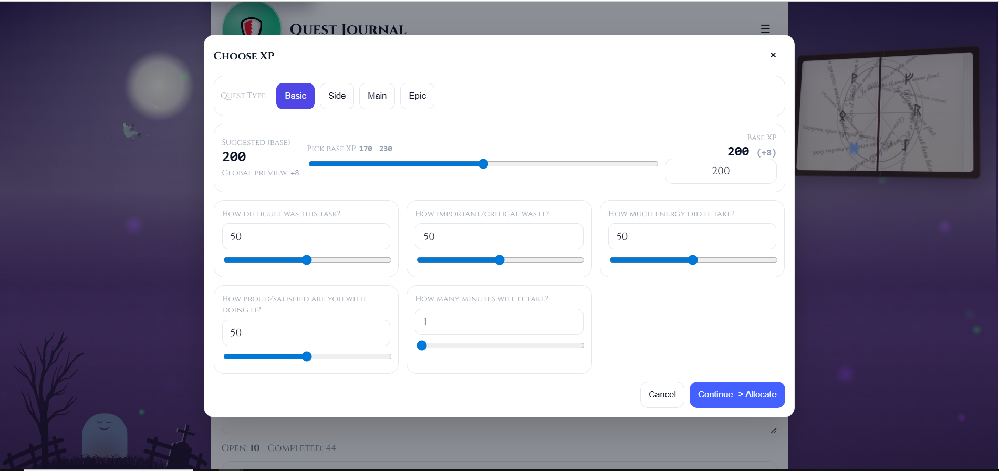
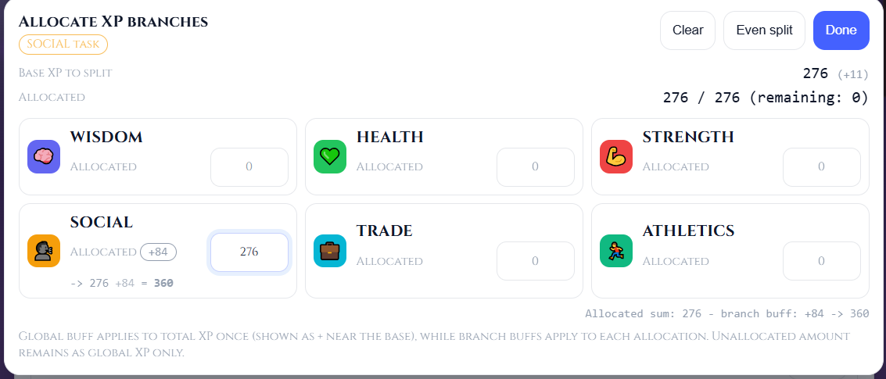
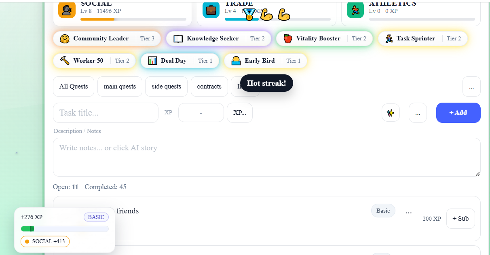

# Quest Journal
Questjournal; if your life had a progress bar.  
Site: https://quest-journal-aa356.web.app/  
A small, fast, gamified personal productivity app. Build quests, earn XP, unlock achievements & perks, keep a journal and story, plan with a calendar, and play focus music—all offline-first, with optional Firebase cloud sync. Built with Vite + React; ships as Web/PWA, Windows desktop (Electron), and Android (Capacitor).

## Screenshots





## Features
- Quests & Lists: main, side, contracts, inbox; fast add/edit, completion rewards.
- XP, Levels, Perks & Achievements: earn XP per task, level up, perks apply effects; achievements hall and celebration animations.
- Daily & Weekly Challenges: templates, today/week state, progress payouts.
- Calendar & Planning: calendar tab to visualize and manage scheduled work.
- Journal & Story tabs: capture notes and a personal narrative alongside tasks.
- Music / Ambient: built-in player with a tavern vibe and Lottie animations.
- Guided Tour: non-intrusive hints via react-joyride.
- Offline-first PWA: service worker registered only in production; long-term caching for assets.
- Cloud Sync: Firebase-backed auth/storage logic modularized in `sync/*` and wired with `useCloudSync`.

## Quick Start
```bash
npm install
npm run dev           # http://localhost:5173

# Build
npm run build         # outputs to /dist
npm run preview
```
